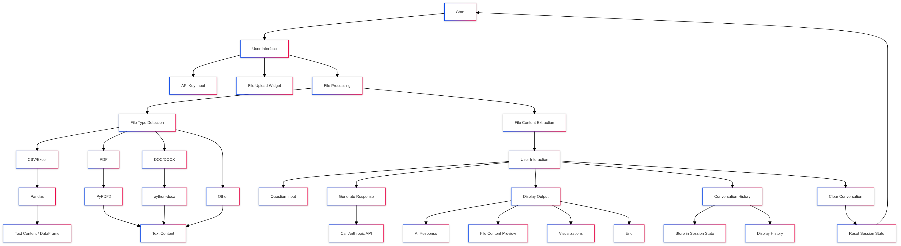

https://github.com/user-attachments/assets/3edccc72-91c8-46af-b752-a48206ba75e8

# 🗣️Data Visualization Assistant

## Overview
The **Data Visualization Assistant** is a Streamlit-based web application that allows users to upload any type of file (PDF, DOCX, Excel, CSV, JSON, etc.) and interact with the content via a conversational AI interface powered by Anthropics. Users can ask questions related to the uploaded file, and the AI will generate responses based on the file's content.

## Features
- **File Upload**: Supports multiple file types including PDFs, Word documents, Excel sheets, CSVs, JSONs, and plain text files.
- **Conversational Interface**: Users can ask questions about the content of the uploaded files, and the AI provides relevant answers.
- **Session History**: Maintains conversation history during the session, allowing users to see previous interactions.
- **Clear Conversation**: Option to clear the conversation history.
- **API Key Input**: Securely input your Anthropics API key through the Streamlit interface.

## Uploading Files and Interacting
- **Upload a File**: On the main interface, upload the file you want to interact with (PDF, DOCX, Excel, CSV, JSON, etc.).
- **Input API Key**: Enter your Anthropics API key in the sidebar to enable the AI functionality.
- **Ask Questions**: Type your questions about the file content in the input box, and the AI will generate a response.
- **View History**: Scroll through the conversation history to review previous interactions.
- **Clear Conversation**: Use the "Clear Conversation" button to reset the conversation history.

## Installation

### Prerequisites
- Python 3.7 or higher
- Streamlit Cloud account (for deployment)

## Security Considerations
- **API Key**: The application does not store your API key. It's securely handled during the session.
- **File Handling**: The application processes files in memory and does not store uploaded files. Supported file types include PDF, DOCX, Excel, CSV, and JSON.
- **Rate Limits**: Be mindful of the rate limits imposed by the Anthropics API. The application does not enforce rate limiting, so excessive use could hit API limits.

## License
This project is licensed under the MIT License. See the LICENSE file for more details.

## Acknowledgements
- Anthropic for providing the API used in this project.
- Streamlit for the web application framework.
